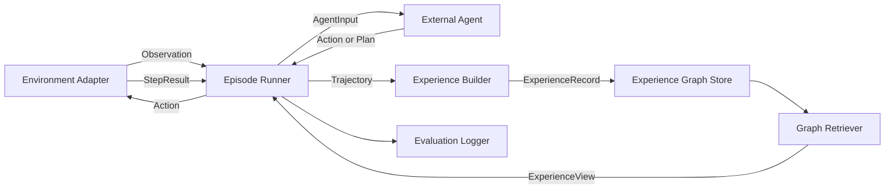
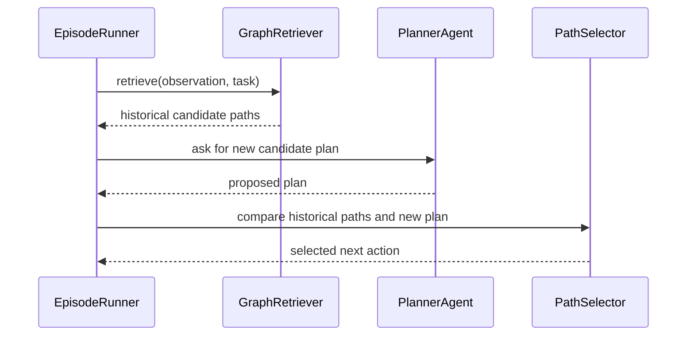
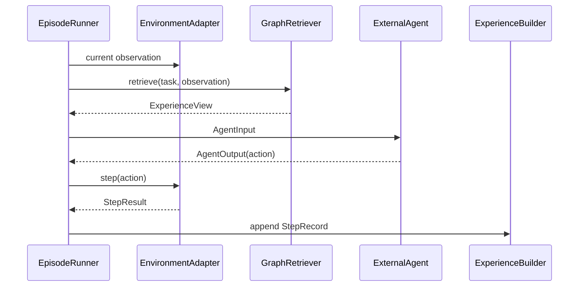
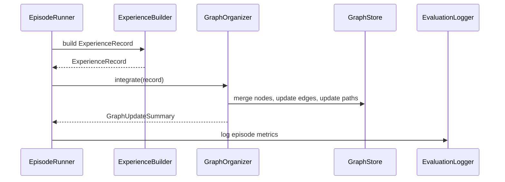

# ExperienceGraph 系统设计文档

## 1. 目标与边界

ExperienceGraph 是一个面向 LLM agent 的跨 episode 经验管理框架。它不直接替代 agent，也不直接替代环境，而是位于 agent 与环境之间，负责记录执行经验、组织条件路径、检索可用经验，并把固定大小的经验视图提供给 agent 决策。

系统目标：

1. 将每次任务执行过程保存为结构化经验，而不是只保存自然语言反思。
2. 用条件路径图表示“在什么状态下，采取什么动作，通常会进入什么状态”。
3. 支持外部 agent 接入，包括 ReAct、Reflexion、纯 LLM planner、工具调用型 agent。
4. 支持外部环境接入，TextCraft 是第一个环境，但核心框架不依赖 Minecraft 语义。
5. 控制每次给 LLM 的经验信息量，避免图谱随 episode 增长后直接塞进 prompt。

非目标：

1. 不负责训练 LLM 参数。
2. 不实现真实 Minecraft 客户端控制。
3. 不把所有世界知识都写进 prompt，而是通过环境规则、经验图谱和检索视图共同提供。
4. 不保证图谱学习结果单调变好，只通过统计、衰减、剪枝和评估降低错误经验长期影响。

## 2. 总体架构



核心模块：

| 模块 | 职责 |
|------|------|
| `EnvironmentAdapter` | 统一环境接口，把 TextCraft 或其他环境包装成标准 observation/action/result |
| `ExternalAgent` | 外部智能体接口，只要求能接收输入并输出动作或计划 |
| `EpisodeRunner` | 控制 episode 执行过程，连接环境、agent、经验图谱和日志 |
| `ExperienceBuilder` | 将 trajectory 转换为结构化经验记录 |
| `ExperienceGraphStore` | 保存节点、边、路径、统计信息和合并记录 |
| `GraphRetriever` | 从图谱中检索当前状态可用路径，生成固定预算的经验视图 |
| `GraphOrganizer` | 合并节点、更新边统计、压缩图谱、维护索引 |
| `EvaluationLogger` | 记录实验指标、token 使用、图谱增长、成功率 |

## 3. 核心数据模型

### 3.1 Condition

`Condition` 是图谱中最基本的状态表达。它不是完整环境状态，而是对决策有用的条件。

```python
@dataclass
class Condition:
    key: str                 # example: "inventory.diamond"
    operator: str            # "==", ">=", "exists", "in", "unknown"
    value: Any               # example: 24, True, ["iron", "diamond"]
    source: str              # "env", "agent", "llm", "rule"
    confidence: float = 1.0
```

例子：

```json
{"key": "inventory.diamond", "operator": ">=", "value": 24, "source": "env"}
{"key": "environment.village_has_armorer", "operator": "==", "value": true, "source": "explore"}
{"key": "tool.pickaxe_level", "operator": "in", "value": ["iron", "diamond", "netherite"], "source": "rule"}
```

### 3.2 GraphNode

节点表示“状态条件集合”。节点不表示动作，动作只存在于边上。

```python
@dataclass
class GraphNode:
    id: str
    label: str
    node_type: Literal["start", "checkpoint", "observation", "goal"]
    required: list[Condition]
    suggested: list[str]
    stats: NodeStats
    metadata: dict[str, Any]
```

节点例子：

```json
{
  "id": "node_has_diamonds",
  "label": "has enough diamonds",
  "node_type": "checkpoint",
  "required": [
    {"key": "inventory.diamond", "operator": ">=", "value": 24, "source": "env"},
    {"key": "inventory.crafting_table", "operator": "==", "value": true, "source": "env"}
  ],
  "suggested": ["nearby crafting table reduces movement cost"],
  "stats": {"attempts": 30, "successes": 22, "avg_steps_to_goal": 2.1}
}
```

### 3.3 GraphEdge

边表示“满足源节点条件后，执行某个动作，尝试到达目标节点”。

```python
@dataclass
class GraphEdge:
    id: str
    from_node: str
    to_node: str
    action_template: ActionTemplate
    hard_preconditions: list[Condition]
    soft_preconditions: list[str]
    effects: list[Condition]
    stats: EdgeStats
    status: Literal["active", "dormant", "archived"]
```

边例子：

```json
{
  "id": "edge_mine_diamond",
  "from_node": "node_has_iron_pickaxe",
  "to_node": "node_has_diamonds",
  "action_template": {"name": "mine", "args": {"resource": "diamond"}},
  "hard_preconditions": [
    {"key": "tool.pickaxe_level", "operator": "in", "value": ["iron", "diamond", "netherite"], "source": "rule"},
    {"key": "environment.nearby_mine", "operator": "==", "value": true, "source": "env"}
  ],
  "soft_preconditions": ["deeper mine usually has higher diamond yield"],
  "effects": [
    {"key": "inventory.diamond", "operator": ">=", "value": 24, "source": "env"}
  ],
  "stats": {"attempts": 20, "successes": 14, "avg_cost": 6.8}
}
```

### 3.4 PathRecord

路径是从当前条件到目标的一组边序列。路径拥有独立统计，不能只依赖边统计。

```python
@dataclass
class PathRecord:
    id: str
    task_id: str
    start_signature: str
    goal_node: str
    edge_ids: list[str]
    stats: PathStats
    last_used_episode: int
```

路径评分建议：

```text
score(path) = success_score - cost_penalty - uncertainty_penalty + recency_bonus
```

其中：

- `success_score` 优先来自路径级成功率。
- 路径样本不足时，用边成功率乘积估计。
- 成功率使用 Beta smoothing，避免 `1/1` 这类少量样本过度影响选择。
- `uncertainty_penalty` 来自 hidden condition、低样本量、LLM 合并产生的不确定节点。

### 3.5 ExperienceRecord

一次 episode 结束后，系统生成一条经验记录。它是图谱更新的输入，也是实验复盘的基本单位。

```python
@dataclass
class ExperienceRecord:
    episode_id: str
    task_id: str
    initial_observation: Observation
    final_observation: Observation
    trajectory: list[StepRecord]
    success: bool
    failure_reason: str | None
    discovered_conditions: list[Condition]
    proposed_plan: Plan | None
    executed_path: list[str]
    metrics: dict[str, Any]
```

`StepRecord`：

```python
@dataclass
class StepRecord:
    step_index: int
    observation_before: Observation
    experience_view_id: str | None
    agent_thought: str | None
    action: Action
    result: StepResult
    observation_after: Observation
```

这就是本文所说的“经验”：不是一句反思文本，而是包含状态、动作、结果、失败原因、发现信息和统计更新依据的结构化记录。

## 4. 外部 Agent 接入方式

### 4.1 Agent 接口

外部 agent 只需要实现两个方法。

```python
class ExternalAgent(Protocol):
    def act(self, agent_input: AgentInput) -> AgentOutput:
        ...

    def update(self, feedback: EpisodeFeedback) -> None:
        ...
```

`AgentInput`：

```python
@dataclass
class AgentInput:
    task: TaskSpec
    observation: Observation
    available_actions: list[ActionSpec]
    experience_view: ExperienceView
    step_budget_remaining: int
```

`AgentOutput`：

```python
@dataclass
class AgentOutput:
    action: Action | None
    plan: Plan | None
    rationale: str | None
    confidence: float | None
```

约束：

1. agent 可以输出单步 action，也可以输出多步 plan。
2. 如果输出 plan，`EpisodeRunner` 只执行当前步对应 action，后续步骤每轮重新确认。
3. agent 不直接读写图谱，只通过 `experience_view` 使用图谱信息。
4. agent 的内部记忆可以存在，但实验中需要按方法条件明确开关。

### 4.2 ReAct Agent 接入

ReAct Agent 的输入包含当前 observation、动作空间、经验视图。它每轮输出一个 action。

```text
Observation:
- inventory.diamond = 0
- inventory.emerald = 18
- nearby_village = true
- village_has_armorer = unknown

Experience View:
1. If village_has_armorer=true, trading path succeeded 8/10, avg 4 steps.
2. If nearby_mine=true and iron_pickaxe exists, mining path succeeded 14/20, avg 7 steps.
3. Unknown armorer should be inspected before committing to trading.

Available Actions:
- explore(village)
- trade(armorer, emerald, diamond_boots)
- move_to(mine)
- mine(diamond)
```

ReAct 的 graph usage 是只读的：它不自己合并经验，也不直接改统计。

### 4.3 Reflexion Agent 接入

Reflexion Agent 保留自己的文本反思列表。ExperienceGraph 只作为外部经验源存在。

对照实验可配置为：

| 实验条件 | Agent 内部文本记忆 | ExperienceGraph |
|----------|-------------------|-----------------|
| ReAct | 关闭 | 关闭 |
| Reflexion | 开启 | 关闭 |
| Graph Agent | 关闭或只保留短期 scratchpad | 开启 |
| Hybrid | 开启 | 开启 |

建议主实验不要直接使用 Hybrid，否则很难解释提升来自哪里。

### 4.4 Planner Agent 接入

Planner Agent 可以先生成候选路径，系统再把候选路径和图谱路径一起打分。



## 5. 环境接入方式

### 5.1 EnvironmentAdapter 接口

```python
class EnvironmentAdapter(Protocol):
    def reset(self, seed: int, task: TaskSpec) -> Observation:
        ...

    def available_actions(self, observation: Observation) -> list[ActionSpec]:
        ...

    def step(self, action: Action) -> StepResult:
        ...

    def is_success(self, observation: Observation, task: TaskSpec) -> bool:
        ...

    def extract_conditions(self, observation: Observation) -> list[Condition]:
        ...
```

### 5.2 TextCraftAdapter

TextCraftAdapter 负责三类事情：

1. 状态管理：inventory、environment、ambiguous、location、step_count。
2. 规则执行：craft、mine、trade、move_to、explore、gather 的前置条件和状态变化。
3. 条件提取：把完整状态转换成图谱能理解的条件集合。

TextCraft 的动作结果统一为：

```python
@dataclass
class StepResult:
    ok: bool
    action: Action
    observation: Observation
    reward: float
    cost: float
    done: bool
    failure_reason: str | None
    revealed_conditions: list[Condition]
    state_delta: dict[str, Any]
```

例子：

```json
{
  "ok": false,
  "action": {"name": "mine", "args": {"resource": "diamond"}},
  "failure_reason": "missing_required_pickaxe",
  "revealed_conditions": [
    {"key": "tool.pickaxe_level", "operator": "<", "value": "iron", "source": "env"}
  ],
  "state_delta": {}
}
```

失败结果非常重要，因为它能把“失败原因”转成图谱条件，而不是只记录 `success=false`。

## 6. 运行流程

### 6.1 单个 step



### 6.2 episode 结束



## 7. GraphOrganizer 设计

### 7.1 更新输入

GraphOrganizer 接收 `ExperienceRecord`，从中提取：

1. 初始状态条件。
2. 每一步 action 的前置条件和结果。
3. 成功路径或失败路径。
4. 新发现的 hidden condition。
5. failure_reason。

### 7.2 节点生成

节点来自三种来源：

| 来源 | 例子 |
|------|------|
| 环境状态条件 | `inventory.diamond >= 24` |
| 动作结果 | `village_has_armorer == true` |
| 失败原因 | `missing_required_pickaxe` 转为 `pickaxe_level >= iron` |

节点生成原则：

1. 只生成对任务有决策意义的条件。
2. 不为每个原始 observation 建节点。
3. 对数值条件使用任务相关阈值，例如 `diamond>=24`，不是保存 `diamond=17` 的所有细节。
4. 对 hidden condition 单独建 observation 节点，方便表达探索价值。

### 7.3 节点合并

合并流程：

```text
new node
  -> canonicalize conditions
  -> exact match search
  -> subsumption/conflict rule check
  -> optional LLM semantic check
  -> merge or create
```

合并记录需要持久化：

```json
{
  "merge_id": "merge_042",
  "new_node": "tmp_node_13",
  "target_node": "node_has_diamonds",
  "decision": "merged",
  "method": "rule_exact_match",
  "rationale": "same canonical required conditions",
  "episode_id": "ep_120"
}
```

这能让后续人工抽样检查“节点合并质量”。

### 7.4 边更新

每个执行过的 action 更新对应边：

- `attempts += 1`
- 成功到达目标条件时 `successes += 1`
- 更新平均 cost、平均 step、最近使用 episode
- 记录常见 failure_reason

失败边也保留，但状态可能进入 `dormant`：

```text
if attempts >= min_attempts and success_rate < threshold:
    edge.status = "dormant"
```

`dormant` 表示默认不展示给 LLM，但图谱仍保留它，用于分析和避免重复犯错。

### 7.5 路径更新

episode 成功时：

1. 从 trajectory 中提取实际成功路径。
2. 计算 start_signature。
3. 更新或创建 PathRecord。
4. 更新路径级 attempts、successes、avg_steps、avg_cost。

episode 失败时：

1. 记录失败路径。
2. 更新边失败统计。
3. 若失败原因可转成条件，把它加入对应边的 hard_preconditions 或 negative evidence。

## 8. GraphRetriever 与 ExperienceView

GraphRetriever 的目标不是返回完整图谱，而是返回当前决策需要的经验视图。

输入：

```python
@dataclass
class RetrieveQuery:
    task: TaskSpec
    observation: Observation
    current_conditions: list[Condition]
    token_budget: int
    top_k: int
```

输出：

```python
@dataclass
class ExperienceView:
    view_id: str
    relevant_conditions: list[Condition]
    candidate_paths: list[CandidatePathView]
    warnings: list[str]
    summaries: list[str]
    token_estimate: int
```

候选路径视图：

```python
@dataclass
class CandidatePathView:
    path_id: str
    label: str
    applicability: Literal["available", "needs_info", "blocked"]
    missing_conditions: list[Condition]
    actions_preview: list[Action]
    success_rate: float | None
    attempts: int
    avg_steps: float | None
    evidence: str
```

检索逻辑：

1. 从当前 observation 提取条件集合。
2. 找到与当前条件匹配或接近的 start node。
3. 搜索到目标节点的候选路径。
4. 过滤 hard precondition 不满足的路径。
5. 对 `needs_info` 路径保留，例如交易路径需要先探索村民职业。
6. 按路径评分排序。
7. 按 token budget 生成 Top-K 完整路径和摘要。

## 9. Agent 决策策略

ExperienceGraph Agent 的默认决策流程：

```text
1. receive observation
2. retrieve historical candidate paths
3. ask LLM to propose one new candidate path
4. compare historical paths and new path
5. select next action
6. execute action
7. update graph after episode
```

路径选择输入包含：

- 当前 observation。
- 可执行动作列表。
- 历史候选路径。
- 新生成路径。
- blocked path 的缺失条件。
- step budget。

LLM 输出建议采用 JSON schema：

```json
{
  "selected_strategy": "inspect_village_then_trade",
  "next_action": {"name": "explore", "args": {"target": "village"}},
  "reason": "Trading path has high success when armorer exists; current armorer status is unknown.",
  "expected_next_condition": "environment.village_has_armorer is revealed"
}
```

## 10. 持久化设计

第一版建议使用文件持久化，便于调试和论文复现。

目录结构：

```text
runs/
  run_2026_06_20_seed_001/
    config.yaml
    episodes.jsonl
    graph_nodes.jsonl
    graph_edges.jsonl
    path_records.jsonl
    merge_decisions.jsonl
    experience_views.jsonl
    metrics.jsonl
```

后续如果图查询复杂，可以替换为 SQLite 或 NetworkX pickle。Neo4j 暂时不建议作为第一版依赖，因为部署成本和实验复现成本较高。

## 11. 配置设计

```yaml
experiment:
  seed: 1
  episodes: 300
  max_steps: 30
  task_id: diamond_set

agent:
  type: experience_graph
  model: gpt-4.1
  temperature: 0.2
  propose_new_path: true

experience_graph:
  top_k_paths: 5
  token_budget: 1000
  min_attempts_for_dormant: 5
  dormant_success_threshold: 0.1
  stats_decay_every: 50
  stats_decay_factor: 0.9
  use_llm_merge: true

environment:
  type: textcraft
  hidden_info: true
  stochastic_events: false
```

## 12. 实验可观测性

每个 episode 必须记录：

1. 初始状态 hash。
2. agent 类型。
3. 是否成功。
4. 步数与 cost。
5. 每步动作与结果。
6. LLM token 使用量。
7. experience_view token 估计。
8. 图谱节点数、边数、路径数。
9. 新增节点数、新增边数。
10. 节点合并决策数量和 LLM 合并调用次数。

关键指标：

| 指标 | 用途 |
|------|------|
| success_rate | 主任务效果 |
| avg_steps_success | 成功 episode 的效率 |
| convergence_episode | 达到目标成功率所需 episode |
| graph_nodes / graph_edges | 回答图增长问题 |
| displayed_tokens | 回答 prompt 预算问题 |
| dormant_edges | 观察低质量经验是否被减少展示 |
| merge_error_rate | 抽样评估合并质量 |

## 13. 第一版开发顺序

1. 定义数据模型：Condition、Observation、Action、StepResult、ExperienceRecord、GraphNode、GraphEdge、PathRecord。
2. 实现 TextCraftAdapter：支持 reset、available_actions、step、extract_conditions。
3. 实现 EpisodeRunner：能让任意 ExternalAgent 完成一个 episode。
4. 实现 ReActAgent baseline：不使用图谱。
5. 实现 ExperienceBuilder：从 trajectory 生成 ExperienceRecord。
6. 实现 GraphStore 和 GraphOrganizer：支持节点合并、边更新、路径更新。
7. 实现 GraphRetriever：输出固定 token 预算的 ExperienceView。
8. 实现 ExperienceGraphAgent：读取 ExperienceView，选择历史路径或新路径。
9. 加 EvaluationLogger：统一输出 metrics.jsonl。
10. 做 10 episode smoke test，确认日志、图谱和路径统计可解释。

## 14. 主要风险与工程处理

| 风险 | 表现 | 处理方式 |
|------|------|----------|
| 节点过多 | 每个 observation 都变成节点 | 只保留任务相关条件，使用阈值化条件 |
| 错误合并 | 两个语义不同条件被合并 | 规则优先，LLM 合并记录 rationale，人工抽样检查 |
| prompt 过长 | 图谱变大后 agent 输入过载 | ExperienceView 固定 token budget，只展示 Top-K |
| 经验误导 | 早期失败经验长期影响 | stats decay、dormant edge、近期经验加权 |
| baseline 不公平 | Graph agent 得到更多信息 | 所有 agent 使用同一 observation 和 action space，图谱信息只作为实验变量 |
| 环境太简单 | 方法优势可能来自手写规则 | 增加 hidden info、多路径和不同初始状态分布 |

## 15. 最小可运行示例

伪代码：

```python
env = TextCraftAdapter(config.environment)
graph_store = JsonGraphStore(run_dir)
organizer = GraphOrganizer(graph_store, config.experience_graph)
retriever = GraphRetriever(graph_store, config.experience_graph)
agent = ExperienceGraphAgent(llm_client, retriever, config.agent)
runner = EpisodeRunner(env, agent, organizer, logger)

for episode_id in range(config.experiment.episodes):
    result = runner.run_episode(
        episode_id=episode_id,
        task=TaskSpec(id="diamond_set"),
        seed=config.experiment.seed + episode_id,
    )
    logger.write(result.metrics)
```

这里的关键点是：`ExperienceGraphAgent` 可以被替换成 `ReActAgent` 或 `ReflexionAgent`，`TextCraftAdapter` 也可以被替换成其他环境 adapter。ExperienceGraph 的核心能力集中在 `ExperienceBuilder`、`GraphOrganizer`、`GraphRetriever` 和 `GraphStore`。

## 16. 推荐的代码目录

```text
experience_graph/
  core/
    models.py
    conditions.py
    scoring.py
  envs/
    base.py
    textcraft.py
    textcraft_rules.py
  agents/
    base.py
    react.py
    reflexion.py
    experience_graph_agent.py
  graph/
    store.py
    organizer.py
    retriever.py
    merge.py
  runners/
    episode_runner.py
  evaluation/
    logger.py
    metrics.py
  prompts/
    react_prompt.md
    graph_agent_prompt.md
  scripts/
    run_experiment.py
    analyze_results.py
```

## 17. 对论文方法部分的对应关系

| 论文概念 | 工程模块 |
|----------|----------|
| TextCraft 环境 | `TextCraftAdapter` |
| Agent | `ExternalAgent` / `ExperienceGraphAgent` |
| 经验 | `ExperienceRecord` |
| 经验图谱 | `GraphStore` 中的 nodes、edges、paths |
| 节点合并 | `GraphOrganizer.merge_nodes()` |
| 路径选择 | `GraphRetriever` + `ExperienceGraphAgent` |
| 图谱压缩 | dormant edge、stats decay、Top-K ExperienceView |
| 统一评估 | `EvaluationLogger` + `metrics.py` |

## 18. 开放问题

1. `Condition` 的 canonicalization 规则需要先覆盖 TextCraft，再考虑通用化。
2. LLM 合并判断是否进入主实验，需要看成本和一致性。
3. 路径评分公式中的权重需要通过开发集确定，不能在测试集上调。
4. 是否加入 RAG-only baseline，取决于论文想强调“经验组织”还是“世界知识接入”。
5. TextCraft 是否引入随机事件要谨慎，第一版建议默认 deterministic，后续实验再打开 stochastic mode。
